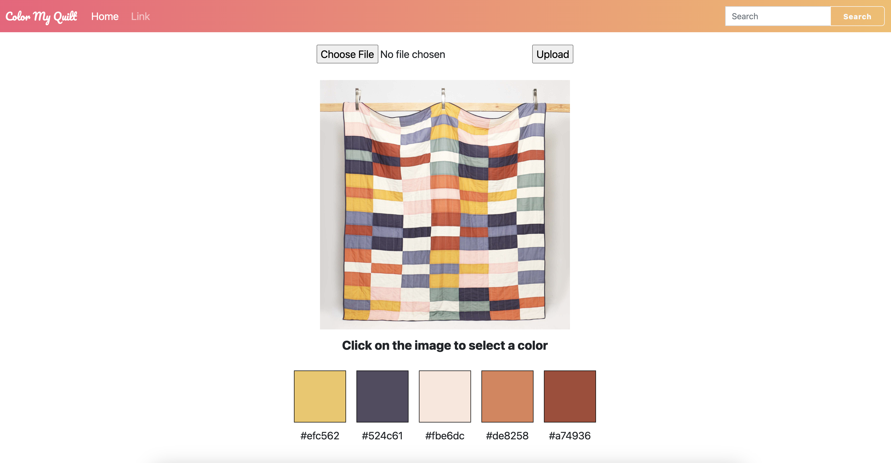

# Color My Quilt

The idea is to build a website that can upload a photo of a quilt, and the program will match the quilt colors with the Kona Solids quilt fabrics that are needed in the quilt.

Will need to address colors showing up differently in different lights. Would be amazing if it could also return a google search of that fabric IRL?

## TODO

* Add Kona color palette matching (i.e. show 5 related colors and let user click 1)
* Add google search to return kona fabrics in the wild?
* Return Kona Color Chart Group (i.e. Leaf is in group "G")
* Add ability to get "similar hex" colors
* Add ability to increase or decrease brightness of selected image?
* Improve button UI
* Add ability to toggle between hex and rgb
* Add Stripe API for funsies

## Buggies

* "No file chosen" is shown as text even when image is still shown